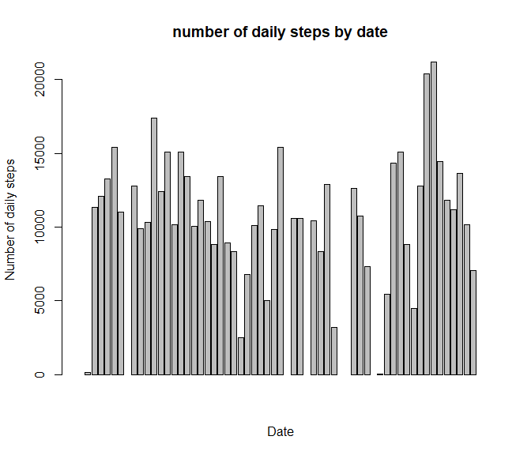
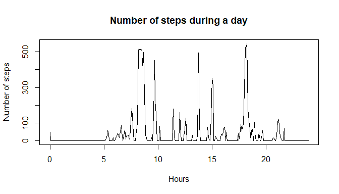
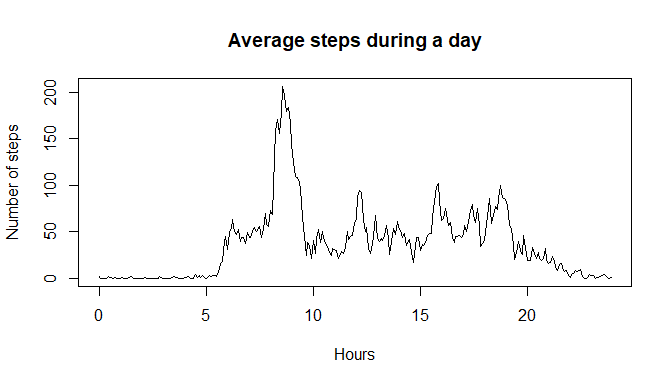
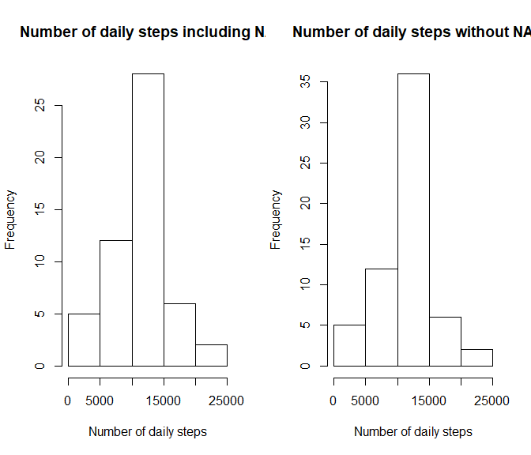
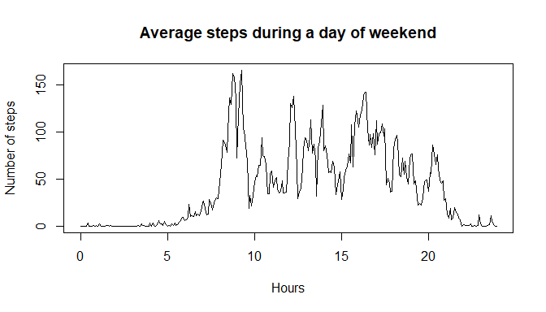
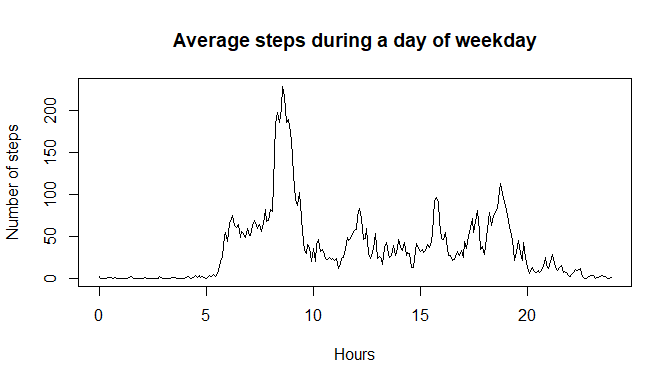

## Abstract
Thanks to this assessment, we can study the steps pattern during a day.
  In fact, it is now possible to collect a large amount of data about personal movement using activity monitoring devices. This device collects data at 5 minute intervals through out the day. The data consists of two months of data from an anonymous individual collected during the months of October and November, 2012 and include the number of steps taken in 5 minute intervals each day.
  We will see that we can retrieve the routine: sleep - go to work - work - sleep.
  Thank you Roger D. Peng from Coursera for giving this assignment.


## Loading and preprocessing the data

First, let's load our data that are zipped into activity.zip.  
We will store the dataframe into the variable mydata.

```r
unzip("activity.zip", "activity.csv")
mydata <- read.csv("activity.csv")
```

  Thanks to Mark Smith from the forum! (I didn't understand why there are 2355 minutes each days :P)  
In fact, the interval of time go from 55 to 100 because the interval is actually the hour and minute of the start time of the interval coded as hhmm.  
It can bias lots of computation if we keep the gap of '50' minutes each time we change of hour.  
I will add a new column with the number of minutes. So 100 (1h00) will become 60 (60 minutes).


```r
library(dplyr)

#function that from a time hhmm gives the number of minutes.
hhmm_to_minutes <- function(hhmm){ 
  minutes <- floor(hhmm/100)*60 + hhmm %% 100
}

# let's add a new column named interval_as_minutes
mydata <- mutate(mydata, interval_as_minutes = hhmm_to_minutes(as.numeric(interval))) 
```


## What is mean total number of steps taken per day?

let's compute the total number of steps taken each date.


```r
data_per_date <- aggregate(mydata[, 1], list(mydata$date), sum)
names(data_per_date) <- c("date", "number_of_daily_steps")
# I prefer the bar plot instead of an histogram here.
barplot(data_per_date$number_of_daily_steps, xlab = "Date", ylab = "Number of daily steps", main = "number of daily steps by date")
```

<!-- -->

```r
mean_daily_steps <- mean(data_per_date$number_of_daily_steps, na.rm = TRUE)
median_daily_steps <- median(data_per_date$number_of_daily_steps, na.rm = TRUE)
```

  The mean of the total steps taken per day is 1.0766\times 10^{4} steps.  
The median is 1.0765\times 10^{4} steps.

## What is the average daily activity pattern?

### looking on a particular date
Let's look the pattern of number of steps every 5 minutes per days.  
For example on the date 2012-10-04 we have :  


```r
date_selected <- data_per_date[4, 1] #I select a date without NA, here : 2012-10-04 
data_to_plot <- mydata[which(mydata$date == date_selected),] # I select the data only for this date
# let's plot the number of steps in function of the interval of time (interval_as_minutes)
# that I will convert into hours because it is simpler to interpret: 
plot(x = data_to_plot$interval_as_minutes / 60 , y = data_to_plot$steps , type = "l", xlab = "Hours", ylab = "Number of steps", main = "Number of steps during a day") 
```

<!-- -->
  In this plot, we can imagine that we are not in the week-end ! In fact we can see major steps near 8 am (when we go to work) and near 6 pm (18 hours, when we come back at home).

### looking the average on all the dates
If we make an average for all the date, we obtain:

```r
# first let's group by interval of time, then compute the mean of number of steps
average_data <- aggregate(mydata$steps, list(mydata$interval_as_minutes), mean, na.rm = TRUE)
names(average_data) <- c("interval_as_minutes", "average_steps")

# plot the average steps, in function of time (converted in hours)
plot(x = average_data$interval_as_minutes / 60 , y = average_data$average_steps , type = "l", xlab = "Hours", ylab = "Number of steps", main = "Average steps during a day")
```

<!-- -->

  We can see a maximum number of steps near 8-9 am (supposing when people go to work).The major activity stays between 6 am and 10 pm (22 hours) : before and after, it is time to bed :-)
  
  let's compute the real interval where the number of steps is the maximum:

```r
best_row <- average_data[which(average_data$average_steps == max(average_data$average_steps, na.rm = TRUE)),]
best_minutes <- best_row$interval_as_minutes[1]
corresponding_hour <- floor(best_minutes / 60)
corresponding_minutes <- best_minutes %% 60
# I will trick to retrieve the corresponding interval
best_interval <- 100 * corresponding_hour + corresponding_minutes
```

  We obtain the interval 835 which corresponds to 8:35.  


## Imputing missing values
Note that there are a number of days/intervals where there are missing values (coded as NA)  
For this part, I don't realy agree with Coursera: to my mind it is not a good thing to replace the NA by other values because I think the replacement can bias the results.
With the NA, it will not bias the result because we ignore them (we don't replace the result by zero). If a day is full of NA, we just have one day missing when we compute the average for exemple. We have no bias, just a less sronger result because less data.  
But if we try to replace the NA values,I think it can only give more bias (for example if we replace the day of NA with the day before, it can be biased if one of them is on the weekend. The same if we give an average on all the days).  
However it is more beautiful on the histogram since the NA for an entire day looks like a "zero steps during the day".  

  But, I will make the coursera exercise.

### How many NA in the dataset


```r
sum_NA <- sum((is.na(mydata) == TRUE))
```
There are 2304 missing values in the dataset.

### a strategy for filling in all of the missing values
Let's devise a strategy for filling in all of the missing values in the dataset. 
I propose to replace a missing day by the mean day we have already commputed.
However, I think it could be better to take another day of the same week-day. Or maybe to make an average between the day before and the day after the one missing.

We will create a new dataset called mydata_without_NA that is equal to the original dataset but with the missing data filled in.


```r
mydata_without_NA <- mydata
for (i in 1:nrow(mydata)){
    if(is.na(mydata$steps[i])){
      # I would like to use the average_data. I will use a modulo to find the corresponding row.
      # In fact, the interval is a cycle of 288 values
        mydata_without_NA$steps[i] <- average_data$average_steps[i%%288 + 1]
    }
}
```


### corresponding histogram

Make a histogram of the total number of steps taken each day and Calculate and report the mean and median total number of steps taken per day. Do these values differ from the estimates from the first part of the assignment? What is the impact of imputing missing data on the estimates of the total daily number of steps?


```r
data_per_date_without_NA <- aggregate(mydata_without_NA[, 1], list(mydata_without_NA$date), sum)
names(data_per_date_without_NA) <- c("date", "number_of_daily_steps")

# I will plot the histogram for the data with NA, and without NA (to compare them)
par(mfrow=c(1,2))    # set the plotting area into a 1*2 array
#hist(data_per_date$number_of_daily_steps, xlab = "Date", ylab = "Number of daily steps", main = "number of daily steps by date including NA values")
#hist(data_per_date_without_NA$number_of_daily_steps, xlab = "Date", ylab = "Number of daily steps", main = "number of daily steps by date without NA values")
hist(data_per_date$number_of_daily_steps, xlab = "Number of daily steps", main = "Number of daily steps including NA")
hist(data_per_date_without_NA$number_of_daily_steps, xlab = "Number of daily steps", main = "Number of daily steps without NA")
```

<!-- -->

```r
# the mean and median igboring the NA have alreday been computed.
mean_daily_steps_without_NA <- mean(data_per_date$number_of_daily_steps)
median_daily_steps_without_NA <- median(data_per_date$number_of_daily_steps)
```
  The mean of the total steps taken per day was 1.0766\times 10^{4} steps including NA values. After their replacement we obtain NA steps. 
  The median of the total steps taken per day was 1.0765\times 10^{4} steps including NA values. After their replacement we obtain NA steps.  


  Here, there is a difference if we replace the NA values, since we add some values. As we replace wih the mean, then for the interval corresponding to the mean ([10000 - 15000]), we have more occurences (exactly the number of NA values more.)
  But I keep saying that I think the mean and median are more biased with the replacement.


## Are there differences in activity patterns between weekdays and weekends?

First let's separate weekdays and weekends to do that, we will create a new factor variable in the dataset with two levels – “weekday” and “weekend” indicating whether a given date is a weekday or weekend day.
We will use the function weekdays().
I would prefere to use the data with the NA, but I will use the second data as asked by the Coursera project.


```r
library(timeDate)
library(dplyr)
```

```r
# My environment is in French... I will set it in English
Sys.setenv(LANGUAGE = "en")
Sys.setlocale("LC_TIME", "English")
```

```
## [1] "English_United States.1252"
```

```r
# Function that return weekend or weekday depending on the given date
DayType <- function(date) {
  day <- weekdays(date)
  if (day %in% c("Monday", "Tuesday", "Wednesday", "Thursday", "Friday"))
      return ("weekday")
  return ("weekend")
}


# Let's add a new column for this new factor.
mydata_without_NA <- mutate(mydata_without_NA, type_of_day = lapply(as.Date(mydata_without_NA$date), DayType))
```


```r
# first let's group by weekend/weekday then interval of time, then compute the mean of number of steps
mydata_weekend <- mydata_without_NA[which(mydata_without_NA$type_of_day == "weekend"),]
mydata_weekday <- mydata_without_NA[which(mydata_without_NA$type_of_day == "weekday"),]

average_data_weekend <- aggregate(mydata_weekend$steps, list(mydata_weekend$interval_as_minutes), mean, na.rm = TRUE)
names(average_data_weekend) <- c("interval_as_minutes", "average_steps")
average_data_weekday <- aggregate(mydata_weekday$steps, list(mydata_weekday$interval_as_minutes), mean, na.rm = TRUE)
names(average_data_weekday) <- c("interval_as_minutes", "average_steps")

# plot the average steps, in function of time (converted in hours)
plot(x = average_data_weekend$interval_as_minutes / 60 , y = average_data_weekend$average_steps , type = "l", xlab = "Hours", ylab = "Number of steps", main = "Average steps during a day of weekend")
```

<!-- -->

```r
plot(x = average_data_weekday$interval_as_minutes / 60 , y = average_data_weekday$average_steps , type = "l", xlab = "Hours", ylab = "Number of steps", main = "Average steps during a day of weekday")
```

<!-- -->


During a week day we have no choice to get up early (To go to work). However, we can see that we get up nearly at the same time during the weekend ! (a routine is difficult o break)

But we don't have to do the trip to work, that's why we have less steps (near 150 instead of 210 steps at 9pm), and we are more constant during the day.

Notes : I think that the replacement of the NA could bias this study, since there are more weekdays, so our mean looks like more as a weekday. If a weekend is missing we replace by a value with the maximum at 9 am....
